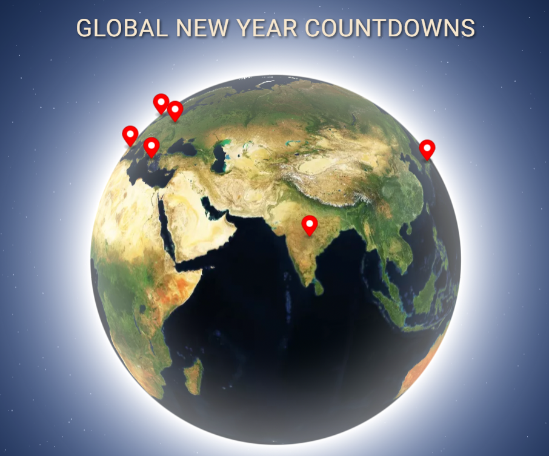
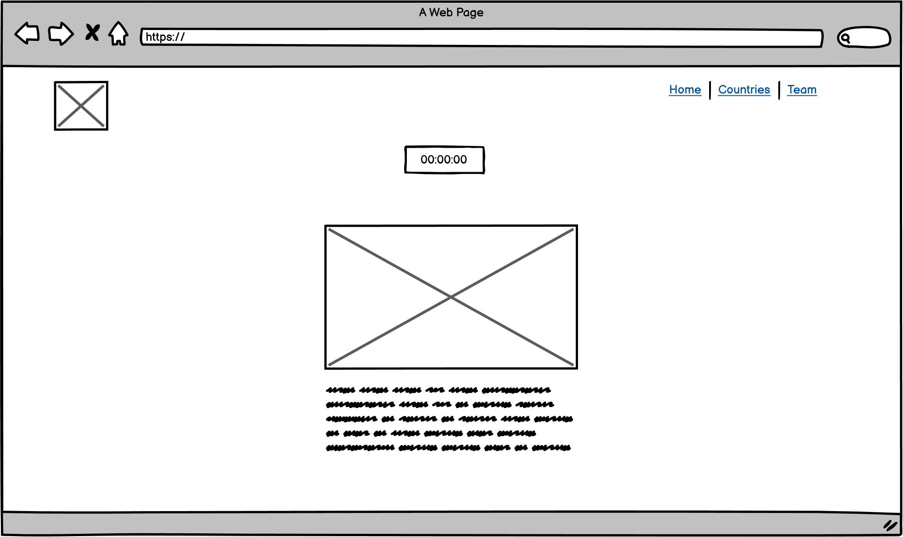
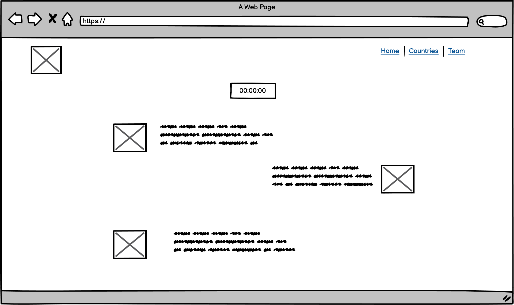

# Festive Timer

Link to deployed project [here](https://festive-timer.netlify.app/)

Festive Timer is a user-friendly application designed for its users to access the New Year countdown timer appropriate for selected time zones and exciting pieces of trivia about pre-selected countries and places worth visiting.

## Table Of Contents

- [User Experience Design](#user-experience-design)
  - [The Strategy Plane](#the-strategy-plane)
    - [Site Goals](#site-goals)
    - [Agile planning](#agile-planning)
      - [Epics](#epics)
      - [User stories](#user-stories)
- [The Scope Plane](#the-scope-plane)
- [The Structure Plane](#the-structure-plane)
  - [Features](#features)
  - [Planned features](#planned-features)
- [The Skeleton Plane](#the-skeleton-plane)
  - [Wireframes](#wireframes)
- [The Surface Plane](#the-surface-plane)
- [Testing](#testing)
- [Technologies and Tools](#technologies-and-tools)
- [Deployment](#deployment)
  - [Deploy to Netlify](#deploy-to-netlify)
  - [Version control](#version-control)
  - [Creating A Fork](#creating-a-fork)
  - [Cloning Repository](#cloning-repository)
- [Credits](#credits)
  - [Media](#media)

## User Experience Design

### The Strategy Plane

#### Site-goals

- Provide a system to allow a user to get a countdown to New Year based on their geo-location.
- Allow users to access interesting facts about New Year traditions in pre-selected countries.
- Expandable application, according to Hackathon conditions and constraints, where content is displayed based on user selection.

#### Agile planning

The project was developed by using agile methodologies. The development cycle was divided into short sprints, where code was delivered in small chunks for flexibility and good coding practice.
Furthermore, the branch system and forking was used to simulate real-life environment.

The Kanban board was created to keep track of project progression and issues assessment. Issues were given acceptance criteria and were split into tasks if feasible.

#### Epics

1. **Base Setup**
   The base setup epic is for all stories needed for the base setup of the application.

1. **UI/UX**
   The UI/UX epic is for all stories related to prototyping and designing a user-friendly interface.

1. **World Map**
   The World Map epic is for all stories related to the world map and geolocation functionality.

1. **Countdown timer**
   The Countdown timer epic for all stories needed for the countdown logic to work in different time zones.

1. **Standalone pages**
   This epic is for all stories related to small pages and functionalities that don't have their epic.

1. **Deployment**
   This epic is for deployment-related stories.

1. **Documentation**
   This epic is for document-related stories. It provides essential documentation to give an insight into the development process.

### User Stories

**EPIC 1: Base Setup**

- As a developer, I need to initialise the project to ensure team members can work in the same environment.
- As a developer, I need to create a proper structure so everyone in the team can work independently without accessing the main branch.

**EPIC 2: UI/UX**

- As a developer, I want to create mockups or wireframes for the webpage's UI/UX design to visualize its layout and structure.
- As a user, I can navigate between different sections of the website so that I can easily access the information or features I need.
- As a developer, I should add a footer so a user has quick access to points of interest

**EPIC 3: Countdown timer**

- As a user, I want to see a visual countdown timer, so that I can easily understand how much time is left until New Year in my selected location.

**EPIC 4: World Map**

- As a user, I want to view a world map on the homepage, so that I can easily navigate to different countries and/or cities for their countdowns.

**EPIC 5: Countries pages**

- As a user, I want to access brief information about each country I select, such as cultural New Year traditions or interesting facts, to learn more about how New Year's is celebrated there.
- As a user, I would like to access the Spain page for a countdown meter and basic information about New Year traditions.
- As a user, I would like to access the Ireland page for a countdown meter and basic information about New Year traditions.
- As a user, I would like to access the India page for a countdown meter and basic information about New Year traditions.
- As a user, I would like to access the Japan page for a countdown meter and basic information about New Year traditions.
- As a user, I would like to access the Greece page for a countdown meter and basic information about New Year traditions.
- As a user, I would like to access the Poland page for a countdown meter and basic information about New Year traditions.

**EPIC 6: Standalone pages**

- As a developer, I should create a team page introducing authors to application visitors.
- As a user, I want to see a friendly and informative "404" error page when I encounter a broken link or reach a non-existent page on the website.

**EPIC 7: Deployment**

- As a developer, I have to deploy the project so the users can visit the website and interact with the app.

**EPIC 8: Documentation**

- As a user and a developer, I want to have a well-documented README.md file for this project so that I can easily understand its purpose, how to set it up, and how to use it effectively.
- - As a user and a developer, I want to have a well-documented TESTING.md file for this project so that I can easily understand its purpose, how to set it up, and how to use it effectively.

## The Scope Plane

- Responsive design - website should support devices from 320px up
- Hamburger menu for mobile devices
- Interactive World Map with countdown to New Year for each location
- Trivia section for countries selected by team members

## The Structure Plane

### Features

`As a User, I can navigate between different sections of the website so that I can easily access the information or features I need.`

Implementation:

**Navigation menu**

- Navigation menu was implemented across all pages
- Hamburger menu is present to provide better support for mobile devices

`As a developer, I should add a footer so a user has quick access to points of interest`

Implementation:

**Footer**

- bottom navigation menu
- quick access to application content

`As a user, I want to see a visual countdown timer, so that I can easily understand how much time is left until New Year in my selected location.`

Implementation:

**Localized countdown timer**

- Countdown timer that corresponds to the user's selection
- Adherence to time zones

`As a user, I want to view a world map on the homepage, so that I can easily navigate to different countries and/or cities for their countdowns.`

Implementation:

**World map**

- Interactive World Map that allows user to select every country
- User geolocation functionality

`As a user, I want to access brief information about each country I select, such as cultural New Year traditions or interesting facts, to learn more about how New Year's is celebrated there.`

Implementation:

**Countries pages**

- countdown timer for each country
- information about New Year traditions and noteworthy locations
- animated images

`As a developer, I should create a team page introducing authors to application visitors.`

Implementation:

**Team page**

- basic information about application authors

`As a User, I want to see a friendly and informative "404" error page when I encounter a broken link or reach a non-existent page on the website.`

Implementation:

**Error 404 page**

- The 404 error page has been implemented to ensure that if one of the pages is mistyped, the user can easily return to any page

### Planned features

- About page for business-oriented purposes

## The Skeleton Plane

### Wireframes

`As a Developer, I want to create mockups or wireframes for the webpage's UI/UX design to visualize its layout and structure`

All wireframes

- 
- 
- 

## The Surface Plane

Dark blue (#031023), light blue (#153c75), white(#f1f1f1) and light-brown (#f7e7ce) were chosen as primary colours for application.
The main font of the application is Roboto font.

## Testing

Testing documentation can be found [here.](./TESTING.md)

## Technologies and tools

- HTML
  - The structure of the website.
- CSS
  - Content styling
- JavaScript
  - Application logic
- Bootstrap
  - Structure, styling and interactive elements
- NPM
  - Package manager
- Parcel
  - Application build/development optimization tool
- Gsap
  - Animations
- Luxon
  - Dates handling
- Google Geocoding API
  - Geo-location functionality
- Mapbox
  - World map rendering
- Rest Countries
  - basic information about countries
- Secret Santa API
  - Processing geographical coordinates
- Balsamiq
  - Wireframes
- Github
  - Repository hosting
- Git
  - Version control
- Google Lighthouse
  - Testing of the website
- Google Chrome Developer Tools
  - Testing and debugging
- W3C HTML Validator
  - HTML code validation
- W3C CSS Validator
  - CSS code validation
- Js Hint
  - JavaScript code validation

## Deployment

### Deploy to Netlify

1. Navigate to [Netlify webiste](https://www.netlify.com/)
2. Connect to Github account via Netlify
3. Authorize Netlify and select the repository
4. Configure settings
5. Build application

### Version control

The website was created in Virtual Studio Code editor, and changes were pushed to the GitHub repository by using bash terminal.

The following commands were used:

`git status` - This command was used to check files staged and not staged for commit

`git add <file.extension>` - This command was used to add changes in file/files, with particular names and extensions, to be staged for commit

`git add .` - This command was used to add changes in all files, regardless of name and extension, to be staged for commit

`git commit -m "commit message"` - This command was used to commit all staged changes to a local repository

`git push` - This command was used to upload all committed locally changes to a GitHub repository

`git pull` - This command was used to pull changes from remote repository into local repository

`git checkout` - This command was used to switch between branches

### Creating a fork

1. Navigate to the [repository](https://github.com/SandraBergstrom/team-8)
2. In the top-right corner of the page click on the fork button and select create a fork.
3. You can change the name of the fork and add description
4. Choose to copy only the main branch or all branches to the new fork.
5. Click Create a Fork. A repository should appear in your GitHub

### Cloning Repository

1. Navigate to the [repository](https://github.com/SandraBergstrom/team-8)
2. Click on the Code button on top of the repository and copy the link.
3. Open Git Bash and change the working directory to the location where you want the cloned directory.
4. Type git clone and then paste the link.
5. Press Enter to create your local clone.

## Credits

JingleSeconds team members

- [Dayana Nashkova](https://github.com/Dayana-N)
- [Oluwaseun Olawunmi Adeoye](https://github.com/57Esther)
- [Sandra Bergstrom](https://github.com/SandraBergstrom)
- [Darrach Barneveld](https://github.com/DarrachBarneveld)
- [Dima Bulavenko](https://github.com/Dima-Bulavenko)
- [Bartosz Gębarowski](https://github.com/bartoszgebarowski)
- [Fireworks Animation](https://codepen.io/hmaw/pen/qBEMLxV)

### Media

Festive Timer application was created for educational purposes only. Their rightful owners own all content, like images, text or any other, used by authors to create this application.

- [Manali](https://wanderon.in/_next/image?url=https%3A%2F%2Fdr7f10k1l6bnm.cloudfront.net%2Fwp-content%2Fuploads%2F2022%2F11%2Fmanali-4.jpg&w=1920&q=75)
- [New Year in Goa](https://www.goatripsindia.com/images/2016/04/New-Year-Celebrations-in-Goa.jpg)
- [Kashmir Warmth bornfire](https://www.kashmirhills.com/wp-content/uploads/2015/12/Kashmir-Warmth-bornfire.jpg)
- [Effigy on fire](https://www.india.com/wp-content/uploads/2018/08/28travel-Burning-Man.jpg)
- [Dublin](https://c.tadst.com/gfx/750w/fireworks-over-building-river-people-on-bridge.jpg)
- [Dingle, Kerry](https://images.ireland.com/media/Images/Kerry/e5a32f6deb944b1dbf247d747bd744ad.jpg)
- [Galway](https://wonder.co.uk/wp-content/uploads/2020/05/declan_colohan_2020-ballinasloe-25-5.jpg)
- [Bread Image](https://d2rdhxfof4qmbb.cloudfront.net/wp-content/uploads/20200106142455/bread.jpg)
- [Japan traditional noodles](https://media.glamour.com/photos/5fc53ee8cea2c24a2fe463d5/master/w_1600,c_limit/957725340)
- [Shibuya Crossing](https://media.timeout.com/images/105692512/750/422/image.jpg)
- [Tokyo Tower](https://flipjapanguide.com/wp-content/uploads/2022/12/New-Years-Eve-events-in-Tokyo-Featured-Image.jpg)
- [Zojoji Temple](https://live.staticflickr.com/149/342200475_2a24e8bdc0_b.jpg)
- [Celebration](https://sp-ao.shortpixel.ai/client/to_webp,q_lossy,ret_img,w_768,h_512/https://travelpolandtours.com/wp-content/uploads/2023/02/2-1024x683.png)
- [Krakow](https://cdn-imgix.headout.com/media/images/87fe368c2922c1b4e91ec1477652c9ef-krakow%2015.jpg?auto=format&w=814.9333333333333&h=458.4&q=90&ar=16%3A9&crop=faces)
- [Zakopane](https://zakopane.com/wp-content/uploads/2020/12/Zakopane-Nowy-Rok-2-scaled.jpeg)
- [Warsaw](https://i.pinimg.com/originals/17/12/ea/1712ea64722814ad872dd4f23dce51bd.jpg)
- [Spain tradition grapes](https://www.spain.info/export/sites/segtur/.content/imagenes/reportajes/genericas/doce-uvas-reloj-nochevieja-s529882711.jpg)
- [Barcelona](https://utopia-villas.com/wp-content/uploads/2019/12/Depositphotos_91258984_xl-2015-2-800x460.jpg)
- [Nochevieja Universitaria in Salamanca](https://3.bp.blogspot.com/-oK8wNAY_zUc/VIB2BBKk5TI/AAAAAAAAAHA/cyeY-KATmws/s1600/131212_salamanca_NUplaza2_0026.jpg)
- [Madrid’s Puerta del Sol Celebration](https://loveatfirstadventure.com/wp-content/uploads/2023/09/new-years-madrid.webp)
- [Onions](https://i0.wp.com/english.lematinal.media/wp-content/uploads/2023/01/During-the-New-Year-People-in-Greece-hang-bunch-of-onions-outside-their-doors.jpg?resize=696%2C522&ssl=1)
- [Thessaloniki](https://www.greece-is.com/wp-content/uploads/2017/12/Thessaloniki_fireworks_shutterstock_768322444.jpg)
- [Corfu](https://www.corfusecret.gr/blog/files/2022-12/1671628525_christmas-in-corfu2.jpg)
- [Athens](https://fusetravels.com/wp-content/uploads/2023/10/4-1.jpg)

### Honourable mentions

- Code Institute - "Secret Santa: A Holiday Hackathon" event organizer
- Vasilica Pavaloi - Code Institute Hackathon team facilitator
- You - for visiting our repository and reading the documentation
