# TESTING 

## Functional testing

### World Map testing

Manual testing was performed to ensure that the world map and geolocation were working properly.

### Countdown timer 
Manual testing was performed to ensure that each counter display correct data, based on time zone.

### Navigation links 

Manual testing was performed to ensure that each link/button leads to the correct webpage within application.

## Responsiveness

All pages were tested to support screen sizes from 320px and upwards.

Steps to test:

1. Open the browser and navigate to [Festive Timer]()
1. Open the developer tools
1. Set to dimensions to responsive
1. Set the zoom to 50%
1. Click the grey bar on the left to change the width

Website was also opened on the following mobile devices available to team members

## Accessibility

Wave Evaluation Tool was used throughout the development process and for final testing. The following tests were conducted: 

* Webpage structure implementation test
* HTML lang attribute test
* Contrast errors test

## Lighthouse 

Lighthouse was used throughout the development process to monitor application performance.
## Validators

### HTML

The code passed through W3C Markup validator with no significant issues.

|Page|Validator|Result|Comment|
| --- | --- | --- |----|
| Home |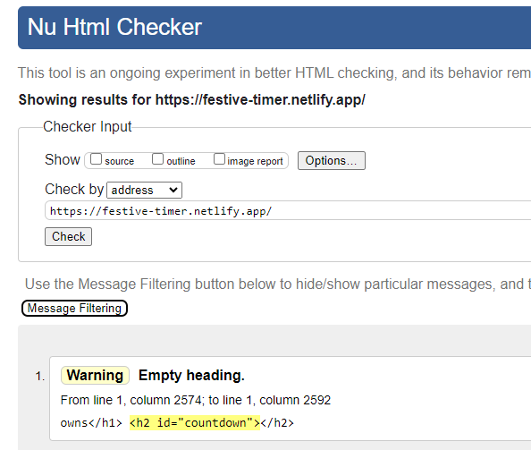 | <mark>PASS<mark> |The h2 element showing as a warning is dynamically updated with JavaScript |
| Greece |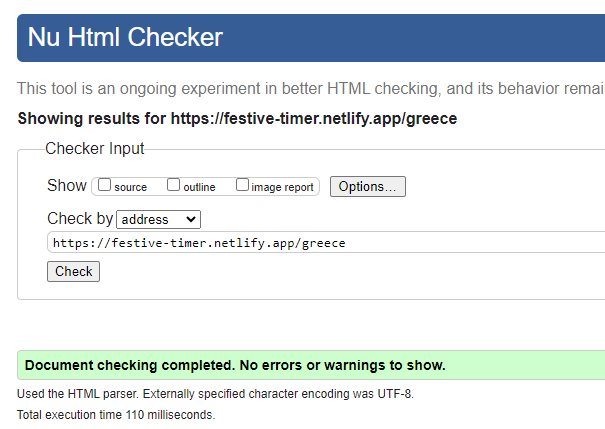 | <mark>PASS<mark> | |
| India |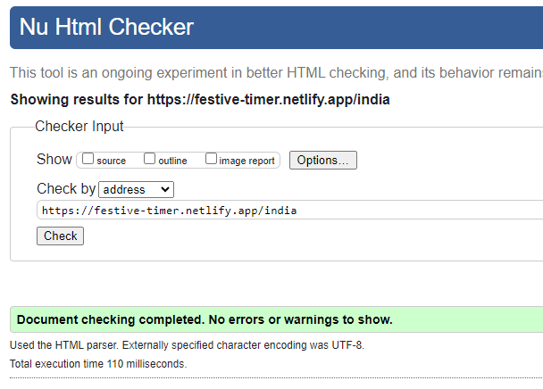 | <mark>PASS<mark> | |
| Ireland |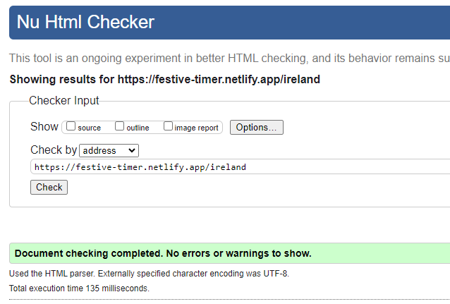 | <mark>PASS<mark> | |
| Japan |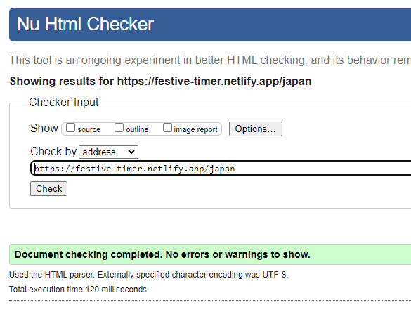 | <mark>PASS<mark> | |
| Poland |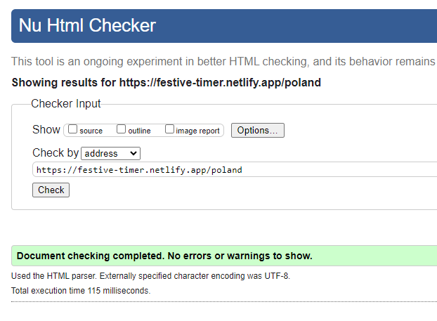 | <mark>PASS<mark> | |
| Spain |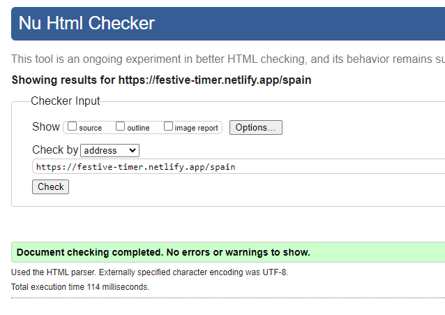 | <mark>PASS<mark> | |
| Team |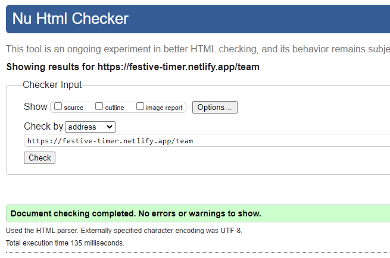 | <mark>PASS<mark> | |
### CSS

CSS file, included with this project, passed through Jigsaw validator with no significant issues.

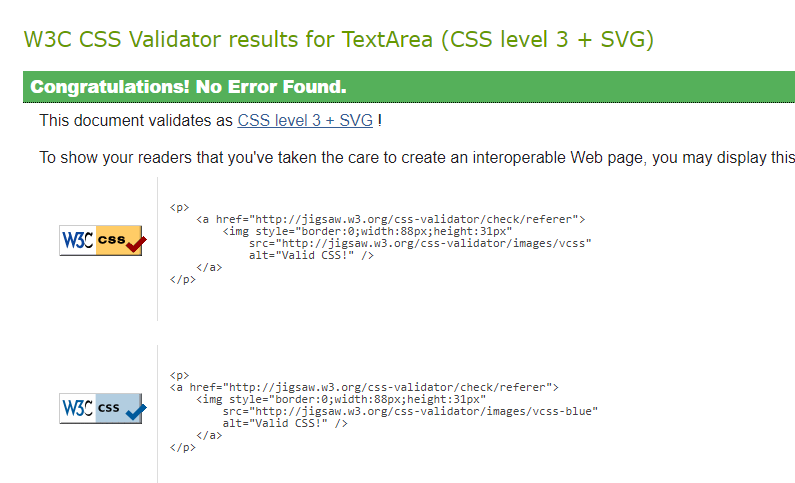
### JavaScript

The code passed through JSHint validator with no significant issues.

|file|Validator|Result|Comment|
| --- | --- | --- |----|
| animation.js |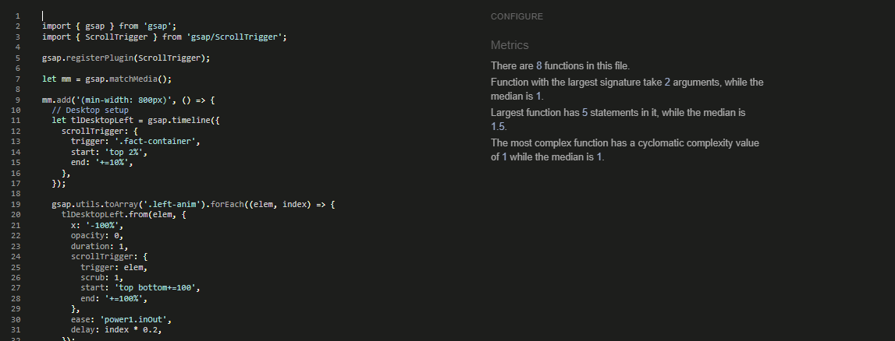 | <mark>PASS<mark> ||
| countdown.js |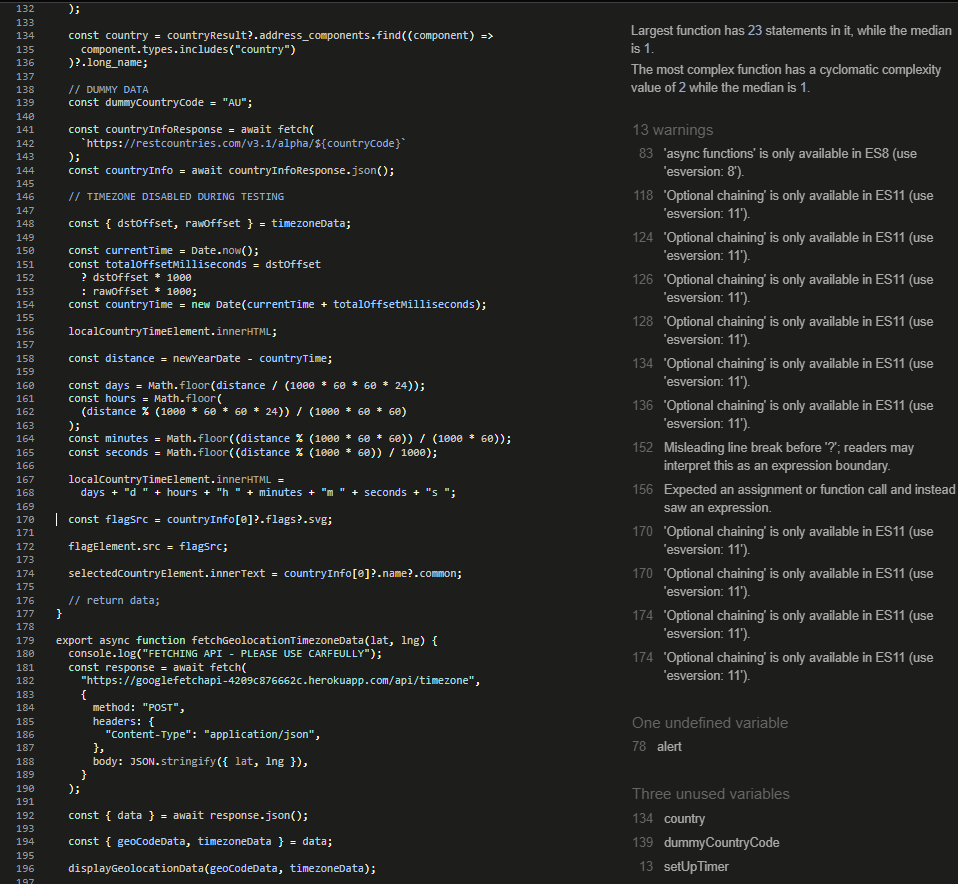 | <mark>PASS<mark> ||
| countdownLocalized.js |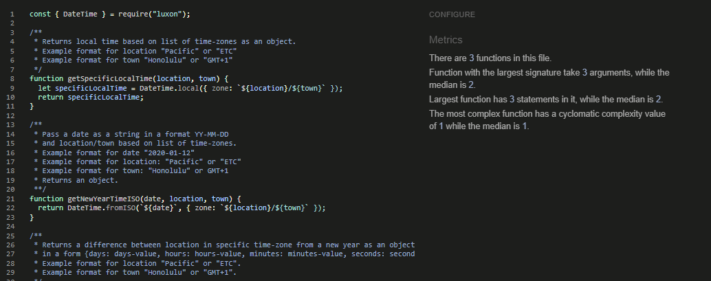 | <mark>PASS<mark> ||
| countryCounter.js |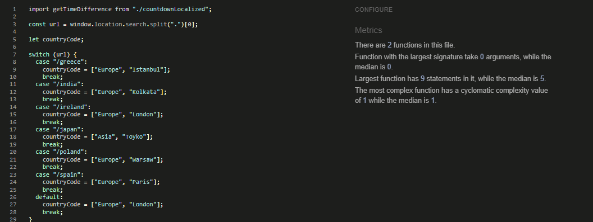 | <mark>PASS<mark> ||
| modal.js |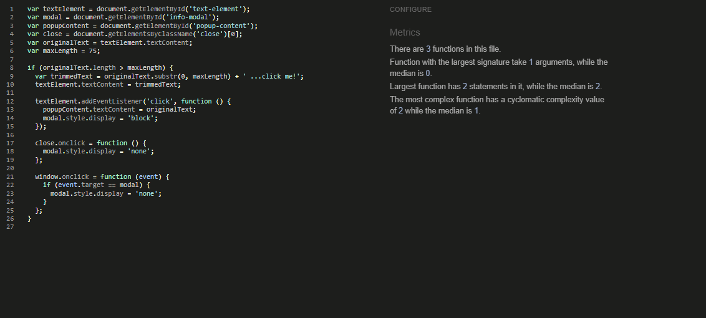 | <mark>PASS<mark> ||
| script.js |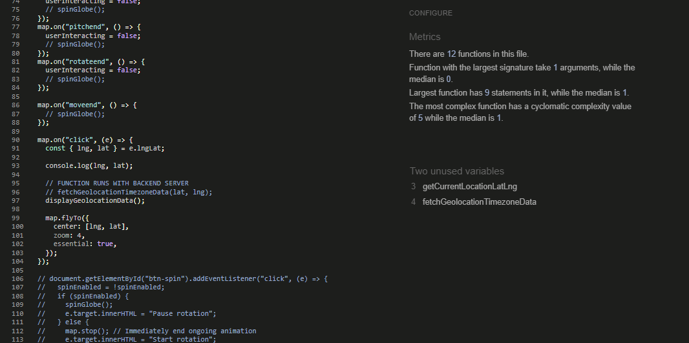 | <mark>PASS<mark> ||
| togglePlay.js |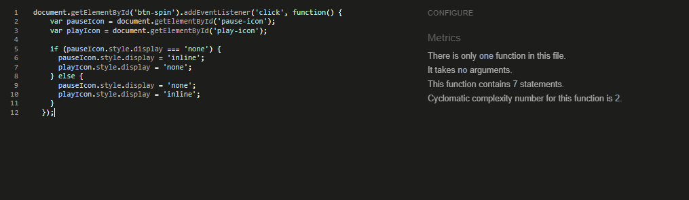 | <mark>PASS<mark> ||